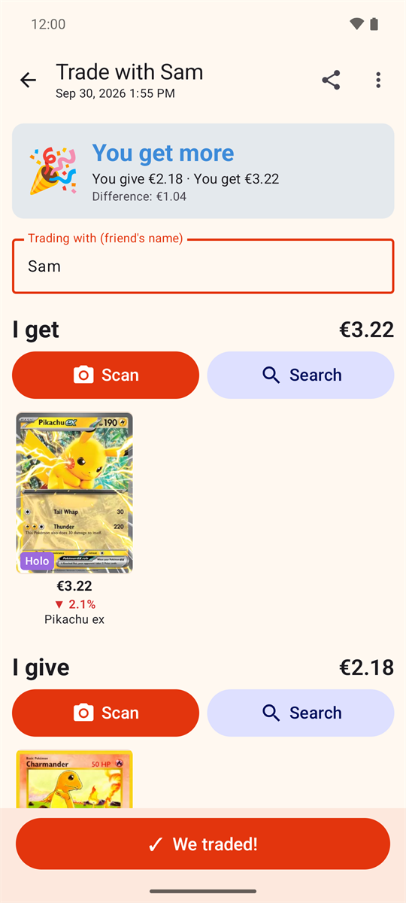
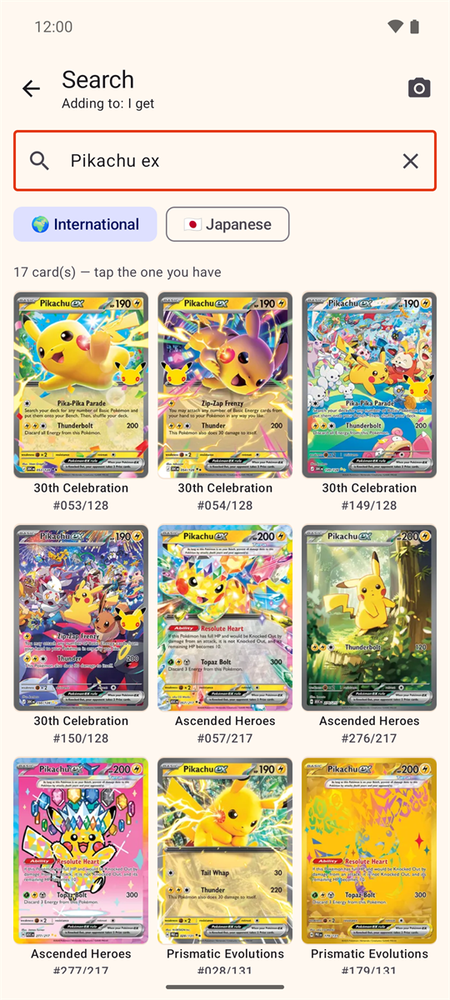
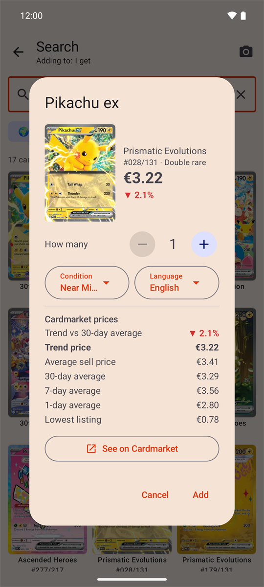
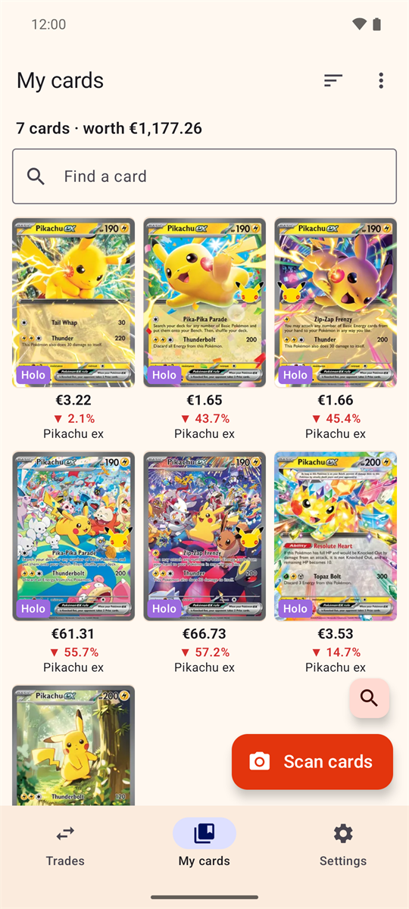
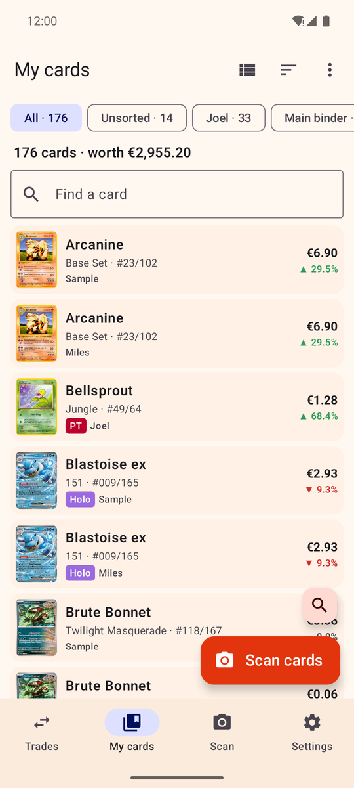
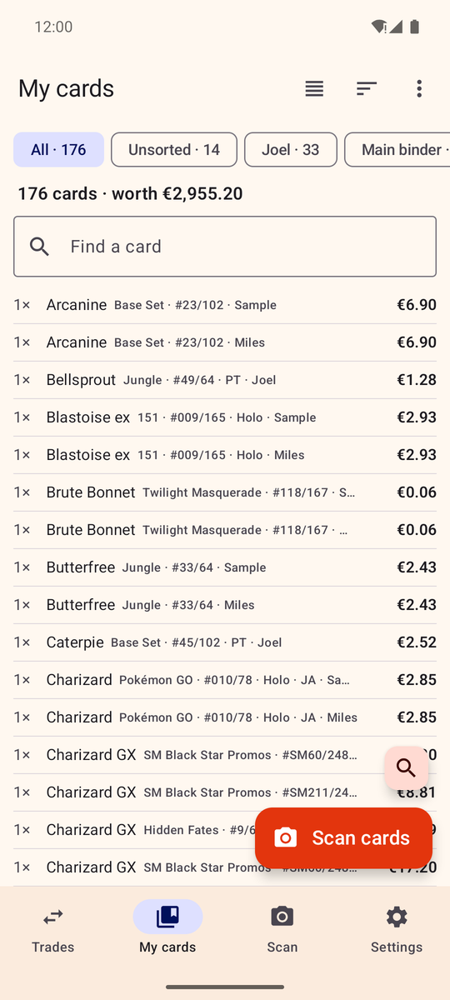

# Poké Trader (Android)

A kid-friendly app for trading Pokémon cards: scan or search the cards on each side, see at a glance whether the
trade is fair (Cardmarket prices, €), and keep "My cards" (the collection) up to date when the trade is done.

| Trade | Search | Card | My cards |
|:---:|:---:|:---:|:---:|
|  |  |  |  |

| My cards: list | My cards: compact |
|:---:|:---:|
|  |  |

## Install
Copy `PokeTrader-1.9.apk` to the phone and open it (allow "install unknown apps" for your file manager/browser when
asked). It's built for 64-bit ARM phones (practically every phone from the last ~6 years). If it refuses to install, use
`PokeTrader-1.9-universal.apk` instead (bigger, runs on any device).

## Binders
"My cards" can be split into binders: the bar above the cards shows **All**, **Unsorted** (cards in no binder) and each
binder with its card count. From the ⋮ menu you can create, rename, delete and **merge** binders (e.g. a "new cards"
binder into your main one; identical cards are combined). Tap a card to move it, or some of its copies, to another
binder. "We traded!" asks which binder the new cards go into (or makes a new one); cards you give are taken from
Unsorted first. The CSV backup keeps each card's binder. Card tiles show the price of one card, with the total for a
stack underneath ("×4 · €80.00"), and "Most valuable" sorts by that single-card price.

"My cards" can be shown as **cards** (big pictures, the default), a **list** (small picture, set and number, tags and
price) or **compact** (one text line per card); pick it with the view button next to Sort. Every sort can be
reversed (A to Z / Z to A, most valuable / cheapest first, newest / oldest first).

Tap a card to add **notes** and **what you paid** per card; the card then shows what you paid against what it's worth
now. Both are kept in the CSV backup.

**Value over time:** tap the total above the cards (or ⋮ → Value over time). The app saves the collection's value once
a day, so the chart fills in as days go by; underneath are the cards rising and falling most lately.

## Wishlist
The **★ Wishlist** in the binder bar holds the cards you want: pick it, then scan or search them. Any version of the card
counts unless you limit it to one (e.g. only the reverse holo). Each card shows whether you have it, "Remove the cards I
got since adding them" (⋮ menu) clears what you've got since, and cards on the wishlist show "★ on your wishlist" on the
"I get" side of a trade. The wishlist can be shared as a list and isn't counted in the collection's value.

## Appearance
Settings → **Appearance**: same as the phone, light or dark.

## Scan tab
Scan a pile of cards (or add them by name) into a waiting list, then select some or all of them and send them **to a
binder** or **to a trade**, or **discard** them.

While scanning, every card that's added shows up in a list under the camera with its price: **+** adds another copy,
the undo arrow takes it back, and tapping it lets you change the version, condition, language and **number of copies**.
Prices follow the price type chosen in Settings. Every card window has **Other printing…**, which shows all printings
of the card (other sets, promos, numbers) as pictures to pick from.
Turn **Auto-add** off to confirm each recognised card with an "Add" button first.

**✨ Holo:** with "Let the camera tell" (the default) the scanner looks at how the card shines when a card comes both
with and without foil: a glittering text box means reverse holo, artwork that flickers as the card moves means holo. It
says so on the card ("Looks like a reverse holo · tap if not"); tap to pick another version. "Not holo" and "Holo or
reverse holo" set it by hand, as before.

## Where the data comes from (no app updates needed for new sets)
- **Cards, pictures, names in all languages:** [TCGdex](https://tcgdex.net) (free, open API), looked up live.
  International prints use TCGdex's English data (French/German/… prints share numbers and Cardmarket products);
  Japanese prints are separate sets with their own ids and Cardmarket products.
- **Prices:** Cardmarket's public daily Pokémon price guide (`price_guide_6.json`, ~15 MB), downloaded once a day.
  Each card *variant* (normal, reverse holo, Poké Ball / Master Ball pattern, stamped…) has its own Cardmarket
  product id in TCGdex; reverse holos use the guide's "holo" price columns.
- **Checking TCGdex's Cardmarket links:** Cardmarket's public list of Pokémon singles (`products_singles_6.json`,
  ~14 MB, weekly) names every product with its attacks, e.g. "Erika's Bellsprout [Careless Tackle]". The app uses it
  to fill in cards TCGdex doesn't link, and to replace links that point to another card (Gym Heroes' "Erika's …"
  cards → "Erika", Hidden Fates' Charizard GX 9/68 → the shiny one). A link is only replaced when a product with the
  same name and a matching attack is found in the card's set. Plain versions without their own link use the link
  TCGdex has for the card as a whole. Stamped versions are separate products on Cardmarket, except for cards that only
  exist stamped (e.g. the Wizards promos handed out with the first movie, "1st Movie" / "1st Movie inverted" stamp):
  those use the card's one Cardmarket product. Japanese cards (Japanese names) can't be matched this way.
- **Updates:** automatic by default (on opening the app and in the background); Settings can turn them off or limit
  them to Wi-Fi. "Update now" always runs.
- **Pokémon TCG Pocket** (the phone game) cards are in TCGdex too; they're filtered out everywhere since they don't
  exist on paper.

## Known limits
- 1st Edition and Shadowless vintage cards share one Cardmarket product, so 1st Edition can be under-priced — the app
  warns and offers an "agreed price".
- Card pictures come from TCGdex. For international cards TCGdex has no picture for (some promos and special
  collections), the app falls back to pokemontcg.io's image server, matching sets via pokemontcg.io's set list on
  GitHub. As a last resort it uses TCGplayer's product picture (TCGdex lists a TCGplayer product id for most
  international and some Japanese cards; the id lookup is cached on the phone). Cards with no picture in any of
  these (still many Japanese ones) show name + number + "no picture".
- Search: type a name, optionally followed by the card number ("pikachu 86", "pikachu 86/110", "charizard TG05").
- Price arrows compare Cardmarket's trend price with its 30-day average (▲/▼ with one decimal, ▬ 0.0% when equal);
  cards without a 30-day average (e.g. brand-new printings) show no arrow. Removing a card or deleting a trade can be undone.
- Oversized (jumbo) cards are a version of the normal card ("Jumbo · Holo"), with their own Cardmarket price. The
  camera can't tell size, so a scanned card is added as standard size with a "Big card? Tap it" hint when a jumbo
  version exists. Jumbo cards TCGdex doesn't list can't be added.
- The scanner identifies cards mainly by the printed number ("025/165") plus the name. Holo vs reverse holo can't be
  seen by the camera: use the "✨ Holo" toggle or tap a scanned card to change its version.

## Rebuilding
Same toolchain as the MTG Trader app next door: JDK 17+ and the Android SDK at `%USERPROFILE%\Android\sdk`.
```
set JAVA_HOME=C:\Program Files\Java\jdk-18.0.2
gradlew assembleRelease
```
APKs land in `%LOCALAPPDATA%\poketrader-build\app\outputs\apk\release\` (kept out of OneDrive on purpose).
Bump `versionCode`/`versionName` in `app/build.gradle.kts` for each new release.

**Keep `keystore/` and `keystore.properties` safe and private** (they're git-ignored). Android only installs an update
over the existing app if it's signed with the same key; losing it means uninstalling (and losing the app's data).

Tests: `gradlew testDebugUnitTest` (logic, parser, variants) and `gradlew connectedDebugAndroidTest` (real OCR on six
card images in `app/src/androidTest/assets`, needs a device/emulator with internet; plus editing scanned cards against
an in-memory database).

## Code map
- `data/Tcgdex.kt` – TCGdex client, variant naming, card → printings.
- `data/SetCatalog.kt` – cached set lists (for "/165 → which set?"), Pocket filter.
- `data/PriceGuideRepository.kt` – Cardmarket price guide download/import.
- `data/Repository.kt` – trades, collection, apply/undo, CSV.
- `scan/CardTextParser.kt` – reads name / number / set code / language from OCR lines.
- `scan/CardRecognizer.kt` – turns those clues into a card (or a "which one is it?" choice).
- `ui/` – Compose screens.

## License and disclaimer
The code is released under the [MIT License](LICENSE). That covers this app's code only, not the card data, names or
pictures it shows.

Poké Trader is an unofficial fan project. It isn't affiliated with, endorsed or sponsored by Nintendo, Creatures,
GAME FREAK or The Pokémon Company; Pokémon and the card names and pictures are their trademarks and property.
It also isn't affiliated with TCGdex, Cardmarket, pokemontcg.io or TCGplayer; it uses their public data. Prices are for
guidance only.
